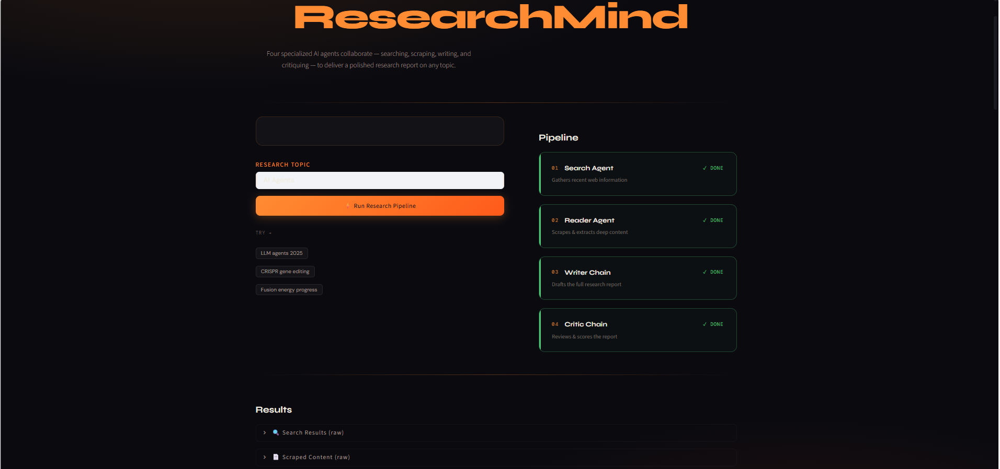
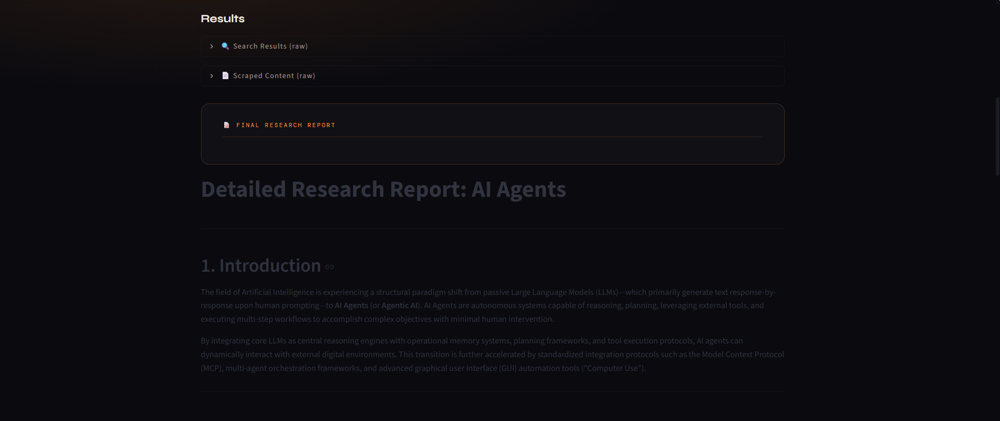
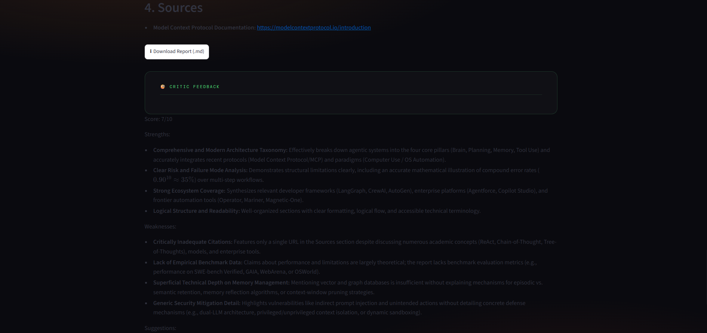

# 🔍 Multi-Agent AI Research System

An AI-powered research assistant that autonomously searches the web, gathers reliable information, analyzes multiple sources, critiques the generated research, and produces structured reports using a Multi-Agent architecture.

Built with **LangChain**, **LangGraph**, **Google Gemini**, **Tavily Search API**, **BeautifulSoup**, and **Streamlit**.

---

# 🚀 Live Demo

> Coming Soon

---

# 📸 Screenshots

## 🏠 Home Page



---

## 🔎 Research Search



---

## 📄 Generated Research Report



---

## 🤖 Multi-Agent Workflow


---

# ✨ Features

- 🤖 Multi-Agent AI Architecture
- 🔎 Intelligent Web Search using Tavily
- 🌐 Website Content Scraping
- 📑 AI-powered Research Report Generation
- 🧠 Research Critique & Quality Review
- 📚 Reliable Multi-source Information Gathering
- ⚡ Google Gemini LLM Integration
- 🎨 Interactive Streamlit Interface
- 🔄 Modular Agent Pipeline using LangGraph
- 📝 Clean and Structured Research Output

---

# 🏗️ Architecture

```
                User Query
                     │
                     ▼
             Search Agent
                     │
                     ▼
             Tavily Web Search
                     │
                     ▼
              Scraping Agent
                     │
                     ▼
           Research Generator
                     │
                     ▼
             Research Critic
                     │
                     ▼
              Final Report
```

---

# 🛠️ Tech Stack

## Programming Language

- Python 3.13

## AI & LLM

- Google Gemini API
- LangChain
- LangGraph

## Search & Research

- Tavily Search API
- BeautifulSoup4
- Requests

## Frontend

- Streamlit

## Environment Management

- Python Virtual Environment
- python-dotenv

## Version Control

- Git
- GitHub

---

# 📂 Project Structure

```
Multi-agent-research-system/
│
├── app.py
├── agents.py
├── pipeline.py
├── tools.py
├── requirements.txt
├── .env.example
├── README.md
│
├── images/
│   ├── home.png
│   ├── search.png
│   ├── report.png
│   └── workflow.png
│
└── venv/
```

---

# ⚙️ Installation

## 1. Clone Repository

```bash
git clone https://github.com/vivek5255-cell/multi-agent-research-system.git

cd multi-agent-research-system
```

---

## 2. Create Virtual Environment

```bash
python -m venv venv
```

---

## 3. Activate Environment

### Windows

```bash
venv\Scripts\activate
```

### Linux / macOS

```bash
source venv/bin/activate
```

---

## 4. Install Dependencies

```bash
pip install -r requirements.txt
```

---

## 5. Configure Environment Variables

Create a `.env` file in the root directory.

```env
GOOGLE_API_KEY=your_google_api_key

TAVILY_API_KEY=your_tavily_api_key
```

---

## 6. Run Application

```bash
streamlit run app.py
```

---

# 🔄 Multi-Agent Workflow

### 1️⃣ Search Agent

- Understands user query
- Searches recent and reliable information
- Uses Tavily Search API

↓

### 2️⃣ Scraping Agent

- Visits selected URLs
- Extracts clean webpage content
- Removes unnecessary HTML elements

↓

### 3️⃣ Research Agent

- Combines all gathered information
- Produces a structured research report

↓

### 4️⃣ Critic Agent

- Reviews generated report
- Improves accuracy
- Ensures clarity and completeness

---

# 📦 Major Libraries Used

| Library | Purpose |
|----------|----------|
| LangChain | LLM orchestration |
| LangGraph | Multi-Agent workflow |
| Google Gemini | AI reasoning |
| Tavily | Web search |
| BeautifulSoup | Web scraping |
| Requests | HTTP requests |
| Streamlit | User Interface |
| python-dotenv | Environment management |

---

# 🎯 Future Improvements

- PDF Report Export
- DOCX Export
- Research History
- User Authentication
- Database Integration
- Docker Support
- Deployment on Streamlit Cloud
- Citation Generator
- Dark Theme
- AI Chat Memory
- Report Sharing
- Download Research as Markdown

---

# 📖 Learning Outcomes

This project demonstrates practical experience with:

- Multi-Agent Systems
- AI Workflow Automation
- LLM Integration
- Prompt Engineering
- API Integration
- Web Scraping
- LangGraph State Management
- Streamlit Application Development
- Modular Python Architecture
- Git & GitHub

---

# 👨‍💻 Author

### Vivek Kumavat

M.Sc. Computer Science

Java Backend Developer | Spring Boot | AI Applications | Python

GitHub

https://github.com/vivek5255-cell

LinkedIn

(Add your LinkedIn URL)

---

# ⭐ Support

If you found this project helpful, consider giving it a ⭐ on GitHub.

It helps others discover the project and motivates future improvements.

---

# 📜 License

This project is licensed under the MIT License.
